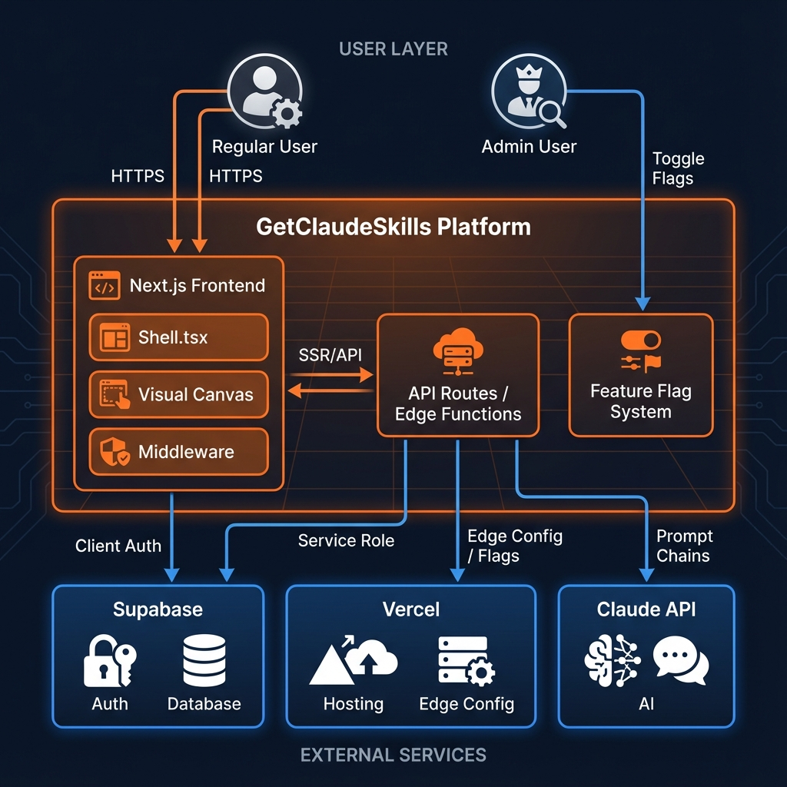
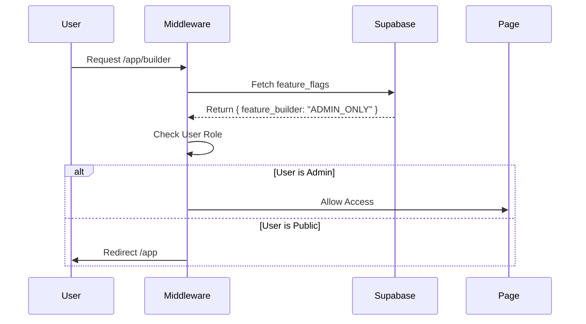

# ClaudeSkillsFacet - Architecture (v3)

**Last Updated:** 2025-12-28
**Current Sprint:** Sprint 18 (Interactive Onboarding)

> **Note:** This document supersedes the Phase 1 MVP architecture. Legacy documentation archived in `docs/archive/phase-1-mvp/`.

## Architecture Principles

1. **Modular:** Clear separation of concerns across UI, state, and generation layers
2. **Dark-First:** Global dark theme enforced for Claude brand alignment
3. **Semantic Theming:** CSS variables enable rapid reskinning
4. **Spec-Compliant:** All outputs follow Claude Agent Skills specification
5. **Type-Safe:** TypeScript end-to-end
6. **Secure:** ABAC (Attribute-Based Access Control) via Feature Flags and Middleware

## System Architecture


*Figure 1: High-level system architecture showing user interactions, platform components, and external service integrations.*

```mermaid
graph TD
    User((User))
    Admin((Admin/DevOps))
    
    subgraph "GetClaudeSkills Platform"
        FE[Next.js Frontend]
        API[API Routes / Edge]
    end
    
    subgraph "External Services"
        Supa[Supabase (Auth/DB)]
        Vercel[Vercel (Hosting/Flags)]
        Claude[Claude API]
    end

    User -->|HTTPS| FE
    Admin -->|HTTPS| FE
    FE -->|Client Auth| Supa
    FE -->|SSR/API| API
    API -->|Service Role| Supa
    API -->|Edge Config| Vercel
    API -->|Prompt Chains| Claude
    Admin -->|Toggle Flags| Vercel
```
*Figure 2: System component diagram showing data flow between platform layers and external services.*

## Detailed Component Architecture

### Frontend Layer
- **Shell.tsx:** Responsive 3-column layout with Feature Flag integration.
- **Middleware:** Server-side route protection based on `feature_flags` in Supabase.
- **Visual Canvas:** ReactFlow-based node editor (`/app/canvas`).
- **OnboardingWizard:** First-visit interactive wizard with A/B comparison (Sprint 18).
  - Uses `NEXT_PUBLIC_PLATFORM_CLAUDE_KEY` for skill preview
  - Parallel streaming for side-by-side output comparison

### State Management
- **Zustand:** `skillStore` (Single Skill), `packageStore` (Bundles).
- **ReactFlow:** Canvas graph state.
- **Context:** `SiteSettingsContext` for dynamic theming and flags.

### Data Flow

#### Feature Flag Resolution


## Directory Structure

```
claude-skills-builder/
├── docs/                           # Central Documentation
│   ├── 00-CURRENT-STATUS.md        # Project heartbeat
│   ├── 02-ARCHITECTURE.md          # This file
│   ├── ADMIN_GUIDE.md              # Operations manual
│   ├── USER_GUIDE.md               # End-user documentation
│   └── images/                     # Documentation assets
│
├── frontend/                        # Next.js 14 application
│   ├── src/
│   │   ├── app/                    # App Router
│   │   │   ├── admin/              # Admin Dashboard
│   │   │   ├── canvas/             # Visual Builder
│   │   │   └── api/                # Backend Routes
│   │   ├── lib/
│   │   │   ├── flags.ts            # Feature Flag Logic
│   │   │   └── supabase.ts         # DB Clients
```

## Deployment & Security

### Security Model
- **Authentication:** Supabase Auth (Email/Magic Link).
- **Authorization:** 
  - **RBAC:** Admin Role (via `NEXT_PUBLIC_ADMIN_EMAILS` whitelist).
  - **Feature Flags:** Dynamic access control per route/component.
- **Persistence:** Supabase `site_settings` table for config.

### CI/CD
- **Platform:** GitHub Actions.
- **E2E Testing:** Playwright (Headless) running on Ubuntu.
- **Preview:** Vercel Preview Deployments for every PR.

## Route Structure

See [`ROUTES.md`](./ROUTES.md) for complete application route mapping including:
- Public, semi-public, protected, and admin-only routes
- API endpoints
- Authentication redirect logic
- Feature flag integration
- Navigation hierarchy
- Orphaned routes requiring ingress

## References

- [Claude Agent Skills Specification](https://docs.anthropic.com)
- [Application Routes](./ROUTES.md)
- [Admin Guide](./ADMIN_GUIDE.md)
- [Test Credentials](./testing/TEST_CREDENTIALS.md)
