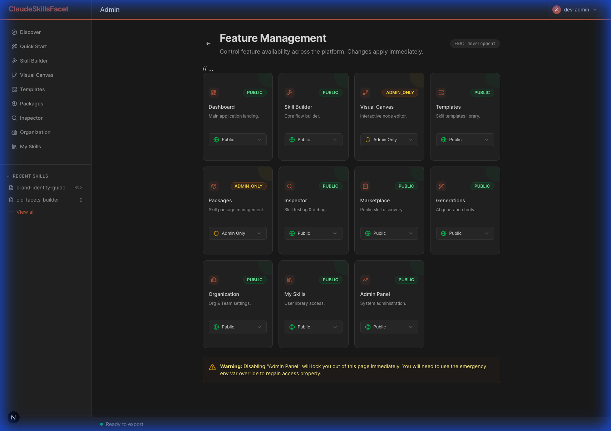
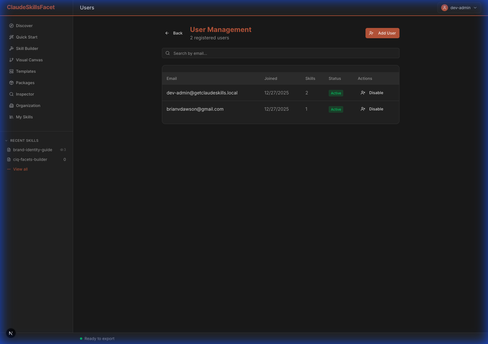
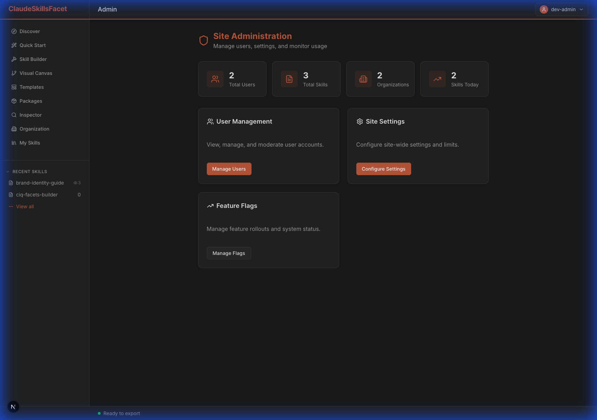

# Admin Guide

> **Last Updated:** 2025-12-31
> **Version:** v2.2 (Post-Sprint 21)

## Table of Contents
1. [Configuration](#configuration)
2. [Feature Flags](#feature-flags-management)
3. [User Management](#user-management)
4. [Dashboard Stats](#dashboard-statistics)
5. [Feedback Management](#feedback-management)
6. [Analytics](#analytics)
7. [Marketplace Management](#marketplace-management)

---

## Configuration

### Required Admin Variables

Administrative access is controlled via environment variables. To grant admin privileges, add email addresses to the admin whitelist.

#### Environment Setup

```env
# Comma-separated list of admin email addresses
NEXT_PUBLIC_ADMIN_EMAILS=admin@example.com,admin2@example.com

# Required for user invitations and backend management
SUPABASE_SERVICE_ROLE_KEY=your-service-role-key

# Platform Claude API key for onboarding skill preview (Sprint 18)
# This key is used to power the A/B comparison in the onboarding wizard
NEXT_PUBLIC_PLATFORM_CLAUDE_KEY=sk-ant-api03-...

# Optional: Force specific feature flag states (emergency use only)
OVERRIDE_FEATURE_FLAGS={"feature_admin":"ADMIN_ONLY"}
```

#### Security Best Practices

- **Limit Admin Access:** Only add trusted team members to `NEXT_PUBLIC_ADMIN_EMAILS`
- **Rotate Service Keys:** Change `SUPABASE_SERVICE_ROLE_KEY` quarterly
- **Use Environment-Specific Keys:** Never share production keys across environments
- **Audit Admin Actions:** Review admin activity logs monthly

> **⚠️ Warning:** The `SUPABASE_SERVICE_ROLE_KEY` bypasses Row Level Security (RLS). Never expose this key in client-side code or public repositories.

---

## Feature Flags Management
*Introduced in Sprint 17*

GetClaudeSkills uses a dynamic feature flag system to control feature availability from the Admin Dashboard (`/app/admin/features`).



### Flag States

Each feature can be set to one of three states:

- **🟢 PUBLIC:** Feature is visible and accessible to ALL users (authenticated and anonymous)
  - **Use case:** Stable, production-ready features ready for general availability
  - **Example:** Skill Builder, Templates, Marketplace

- **🟡 ADMIN_ONLY:** Feature is visible ONLY to users listed in `NEXT_PUBLIC_ADMIN_EMAILS`
  - **Use case:** Beta features, internal tools, or features under testing
  - **Example:** Admin Dashboard, User Management, Advanced Analytics
  - **Note:** Non-admin users will not see these features in navigation or be able to access routes

- **🔴 DISABLED:** Feature is completely locked and inaccessible to everyone
  - **Use case:** Features under development, deprecated features, or emergency shutdowns
  - **Behavior:** Attempts to access disabled features redirect to fallback routes
  - **Example:** Temporarily disabling a buggy feature during incident response

### Managing Flags

#### Via Admin Dashboard (Recommended)
1. Navigate to `/app/admin/features`
2. Locate the feature you want to modify
3. Click the dropdown to select a new state
4. Changes take effect immediately (no restart required)

#### Via Database (Advanced)
1. Access Supabase Dashboard
2. Navigate to `site_settings` table
3. Edit the `feature_flags` JSONB column
4. Update the desired flag key (e.g., `{"feature_builder": "PUBLIC"}`)

### Emergency Override

If you accidentally lock yourself out (e.g., by disabling `feature_admin`), use the server-side environment variable override:

```env
# Force Admin Panel to be accessible (Vercel/Production)
OVERRIDE_FEATURE_FLAGS={"feature_admin":"ADMIN_ONLY"}
```

**Steps to recover:**
1. Add the override to your hosting environment (Vercel, AWS, etc.)
2. Redeploy or restart the application
3. Access `/app/admin/features` to restore proper flag states
4. Remove the override after recovery

> **💡 Best Practice:** Always test flag changes in a staging environment before applying to production.

---

## User Management

Manage platform users at **Admin > Users** (`/app/admin/users`).



### User Operations

#### Viewing Users
- **User List:** Displays all registered users with email, join date, and skill count
- **Search:** Filter users by email address or name
- **Sort:** Click column headers to sort by join date, skill count, or status
- **Pagination:** Navigate through large user lists (25 users per page)

#### Inviting Users
1. Click **"Invite User"** button
2. Enter the recipient's email address
3. Optionally add a custom message
4. Click **"Send Invitation"**
5. User receives a magic link via email
6. Link expires after 24 hours

**Requirements:**
- `SUPABASE_SERVICE_ROLE_KEY` must be configured
- Email service must be enabled in Supabase Auth settings

#### Managing User Status

**Enable/Disable Accounts:**
- Click the toggle switch next to any user
- **Enabled (Green):** User can sign in and access the platform
- **Disabled (Red):** User is locked out (existing sessions terminated)
- **Use case:** Temporarily suspend users for policy violations or security concerns

**Deleting Users:**
- Click the **Delete** icon (🗑️) next to a user
- Confirm the deletion in the modal
- **Warning:** This action is irreversible and deletes all user data (skills, settings, history)

### Bulk Operations

**Export User List:**
1. Click **"Export CSV"** button
2. Download includes: email, join date, skill count, status
3. Use for reporting, analytics, or backup

> **🔒 Privacy Note:** User management actions are logged for audit purposes. Ensure compliance with your organization's data retention policies.

---

## Dashboard Statistics

Real-time analytics and platform health metrics are available at `/app/admin`.



### Key Metrics

#### User Metrics
- **Total Users:** Cumulative count of registered profiles
- **Active Users (30d):** Users who logged in within the last 30 days
- **New Users (7d):** Registrations in the past week
- **User Growth Rate:** Percentage change month-over-month

#### Content Metrics
- **Total Skills:** All skills created across the platform
- **Public Skills:** Skills published to the marketplace
- **Skills Today:** Skills created in the last 24 hours
- **Average Skills per User:** Total skills ÷ total users

#### Organization Metrics
- **Active Organizations:** Teams with at least one member
- **Organization Adoption Rate:** Percentage of users in organizations
- **Largest Organization:** Team with the most members

### Performance Monitoring

**System Health Indicators:**
- **API Response Time:** Average latency for API routes
- **Database Connections:** Active Supabase connections
- **Error Rate:** Percentage of failed requests (last hour)
- **Uptime:** Platform availability percentage (30-day rolling)

**Alerts:**
- 🔴 **Critical:** Error rate > 5% or API latency > 2s
- 🟡 **Warning:** Error rate > 1% or API latency > 1s
- 🟢 **Healthy:** All metrics within normal ranges

### Exporting Reports

1. Click **"Export Report"** in the dashboard header
2. Select date range and metrics to include
3. Choose format: CSV, JSON, or PDF
4. Download begins automatically

> **📊 Analytics Tip:** Use the dashboard to identify usage trends, plan capacity, and measure feature adoption.

---

## Feedback Management
*Introduced in Sprint 21*

View user-submitted feedback at **Admin > Feedback** (`/app/admin/feedback`).

### Viewing Feedback

The feedback dashboard displays all submissions from the floating feedback widget.

**Each entry shows:**
- **Category:** Bug Report 🔴, Feature Request 💡, Question 🔵, or Other
- **Message:** Full text of user feedback
- **Email:** User's email (if provided for follow-up)
- **Page URL:** Where the user was when they submitted
- **Timestamp:** Relative time (e.g., "2 hours ago")

### Feedback Widget

A floating orange button appears in the bottom-left corner of all pages. Users can:
1. Click the button to open the feedback form
2. Select a category
3. Type their message
4. Optionally provide email for follow-up
5. Click "Send Feedback"

**Database Storage:** Feedback is stored in `public.feedback` table with RLS policies.

---

## Analytics
*Introduced in Sprint 21*

Real-time event tracking and user behavior analytics at **Admin > Analytics** (`/app/admin/analytics`).

### Dashboard Overview

The analytics dashboard provides insights into platform usage:

**Stat Cards:**
- **Total Events:** All tracked events in the selected period
- **Total Sessions:** Unique visitor sessions
- **Page Views:** Total page navigation events
- **Skills Created:** New skills saved by users

### Charts

**Daily Active Sessions:**
- Line chart showing unique sessions per day
- Use to identify usage trends and peak days

**Event Breakdown:**
- Horizontal bar chart showing event types (excluding page views)
- Events: skill_create, skill_export, template_use, feedback_submit

**Top Pages:**
- Ranked list of most visited routes
- Use to understand user navigation patterns

### Date Range Filter

Click the period buttons (7d, 14d, 30d) to adjust the analysis window.

### Events Tracked

| Event | Description |
|-------|-------------|
| `page_view` | User navigates to a route |
| `skill_create` | New skill saved to library |
| `skill_export` | ZIP file downloaded |
| `template_use` | Template loaded into builder |
| `feedback_submit` | Feedback form submitted |

**Database Storage:** Events are stored in `public.analytics_events` table.

---

## Marketplace Management
*Sprint 13*

Skills published to the marketplace are managed via Supabase `market_listings`.
- **Verified Badge:** Set `is_verified = true` in DB.
- **Moderation:** Set `listing_status = 'removed'` to hide inappropriate content.
