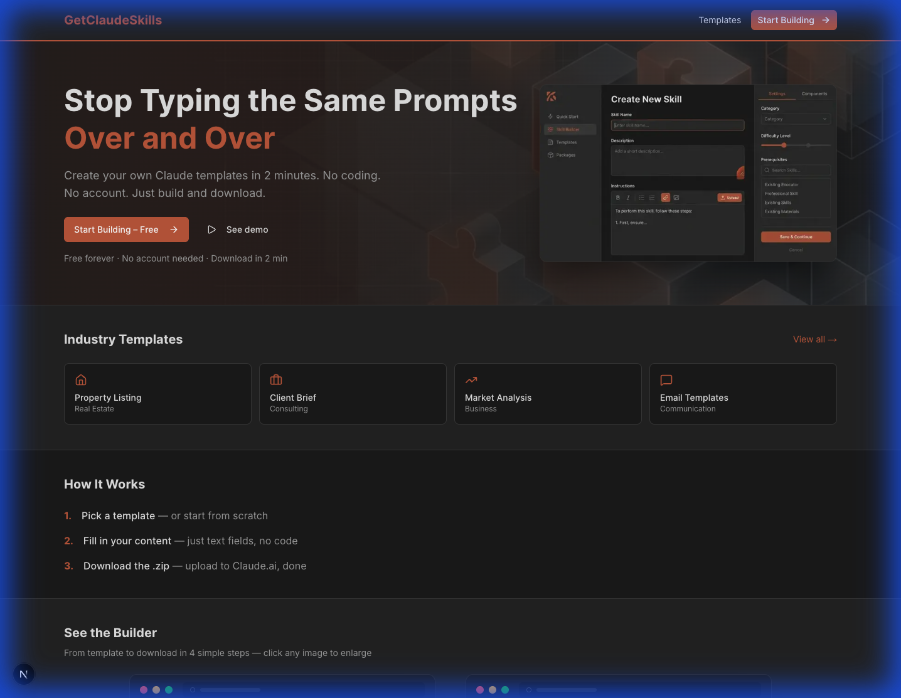
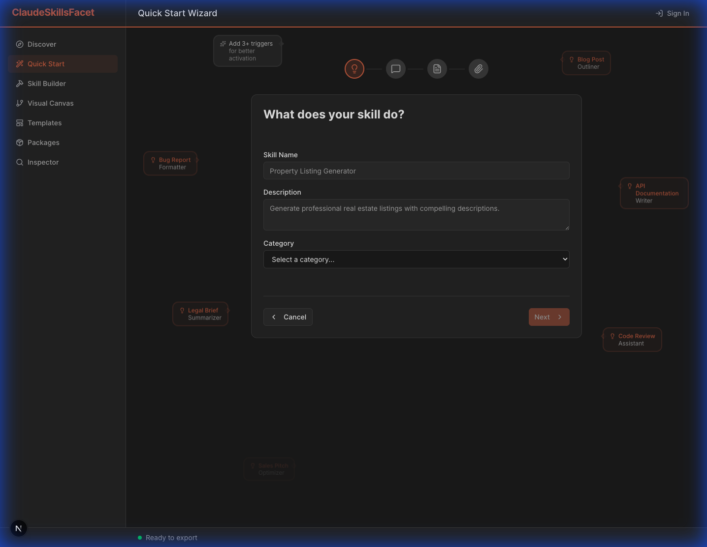
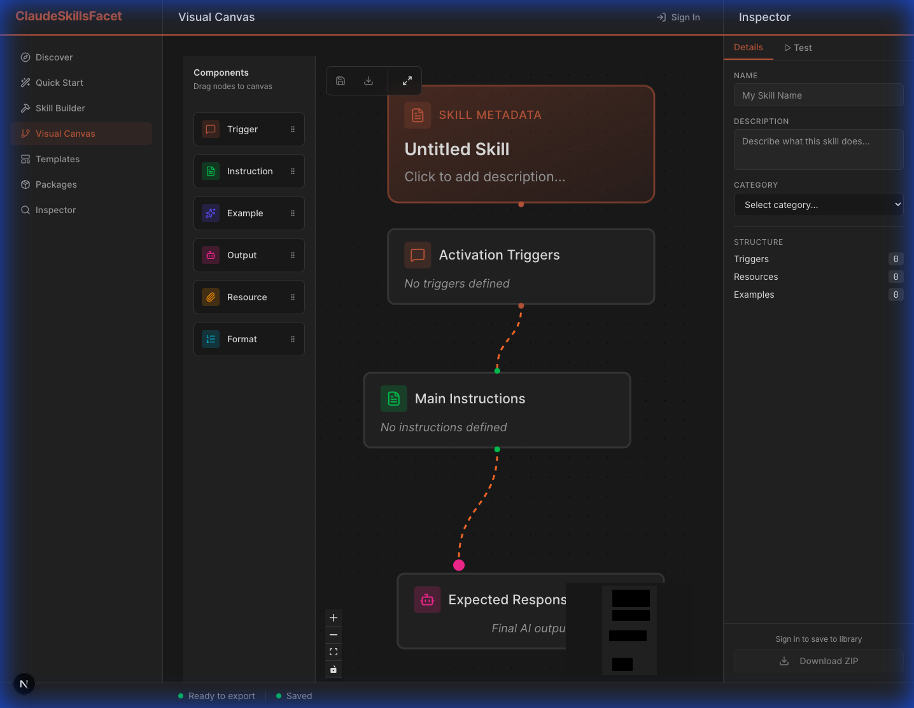
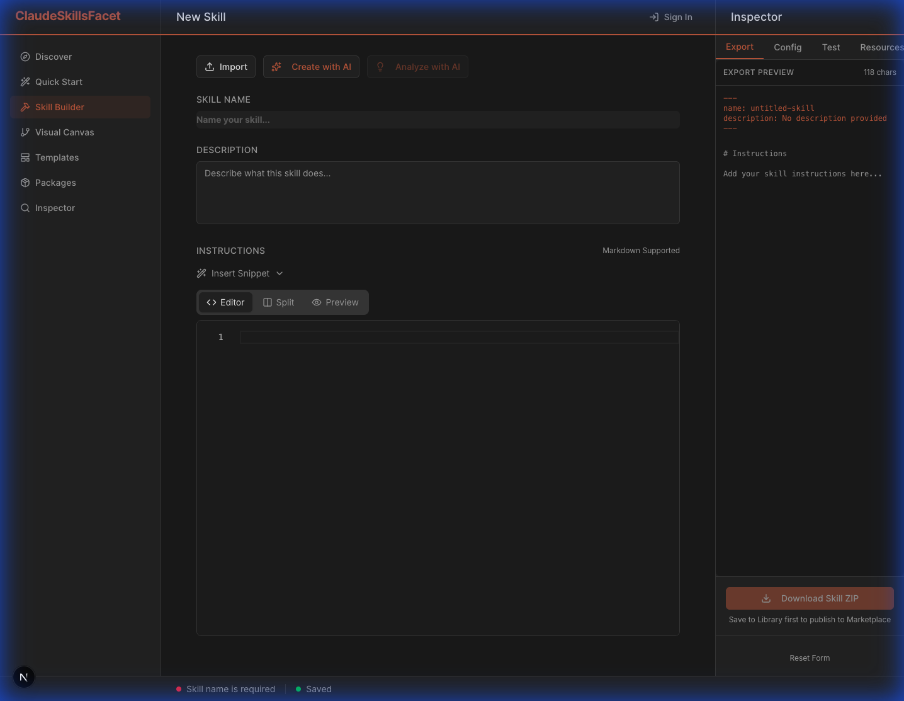
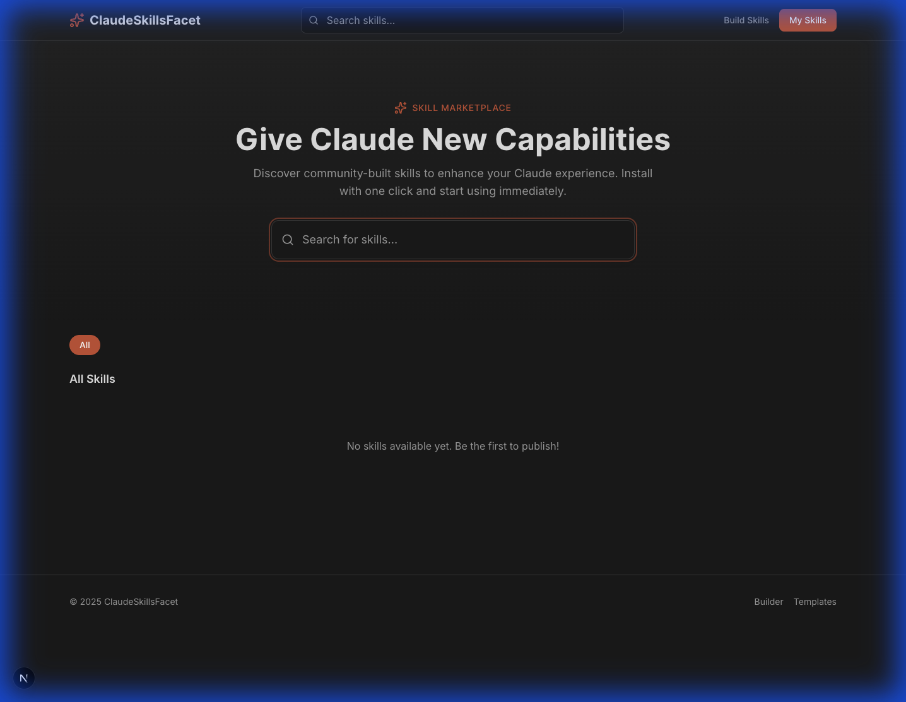

# User Guide

> **Last Updated:** 2025-12-28
> **Version:** v2.0 (Post-Sprint 17)

## Table of Contents
1. [Getting Started](#getting-started)
2. [Skill Wizard](#skill-wizard)
3. [Visual Canvas](#visual-canvas)
4. [Skill Builder](#skill-builder-traditional)
5. [Marketplace & Library](#marketplace--library)
6. [Export & Analysis](#export--analysis)

---

## Getting Started

GetClaudeSkills is a comprehensive platform for creating, managing, and sharing structured prompt "Skills" that extend Claude's capabilities. Skills are reusable templates that define how Claude should behave for specific tasks, complete with instructions, examples, and output formats.

### What are Skills?
**Skills** are structured prompt templates that tell Claude:
- **What role to play** (e.g., "Python expert", "Technical writer")
- **What task to perform** (e.g., "Review code for bugs", "Generate documentation")
- **How to format output** (e.g., Markdown, JSON, code blocks)
- **What context to use** (e.g., project files, style guides)

### Signing In
**Authentication is required** to save skills, access your library, and publish to the marketplace.

1. Visit the application homepage (`/`)
2. Click **Sign In** in the top navigation
3. Enter your email address
4. Check your inbox for a **magic link** (no password needed)
5. Click the link to complete sign-in

> **💡 Tip:** Magic links expire after 1 hour. If your link expires, simply request a new one.

---

## Skill Wizard
*Best for: Beginners, Quick Starts, Rapid Prototyping*

The **Skill Wizard** uses AI to automatically generate complete, production-ready skills based on your project context or specialized topic. Perfect for users who want results fast without manual prompt engineering.

### How It Works
1. **Navigate** to `/app/wizard` or click **"Quick Start"** in the sidebar
2. **Describe your goal** in natural language (e.g., "Create a Python code reviewer that checks for security issues")
3. **Provide context** by:
   - Uploading reference files (code, docs, examples)
   - Pasting sample text or requirements
   - Selecting from pre-defined templates
4. **Generate** - The AI analyzes your input and creates a complete `SKILL.md`
5. **Review & Refine** - Edit the generated skill in the Builder if needed

### Best Practices
- **Be specific** in your goal description for better results
- **Include examples** of desired input/output in your context
- **Upload relevant files** to help the AI understand your domain
- **Iterate** - Generate multiple variations and pick the best one

> **⚡ Pro Tip:** The Wizard is powered by Claude, so the quality of your context directly impacts the quality of the generated skill.

---

## Visual Canvas
*Best for: Architects, Complex Workflows, Multi-Step Processes*

The **Visual Canvas** provides a node-based interface for designing sophisticated skills as interactive flow charts. Ideal for users who think visually and need to build complex, multi-step prompt chains.

### Core Features

#### Node Types
- **🎯 Trigger Nodes:** Define when/how the skill activates (user input, file upload, API call)
- **📝 Instruction Nodes:** Specify what Claude should do at each step
- **📦 Resource Nodes:** Attach context (files, knowledge bases, examples)
- **🔄 Logic Nodes:** Add conditional branching and loops
- **📤 Output Nodes:** Define output format (Markdown, JSON, Code, CSV)

#### Workflow
1. **Drag nodes** from the left palette onto the canvas
2. **Connect nodes** by clicking and dragging between connection points
3. **Configure nodes** by clicking to open the inspector panel
4. **Test the flow** using the "Run" button in the toolbar
5. **Export** the completed skill to your library

### Advanced Capabilities
- **Branching Logic:** Create conditional paths based on user input or AI decisions
- **Nested Skills:** Reference other skills as sub-nodes for modular design
- **Version Control:** Save snapshots of your canvas at different stages
- **Collaboration:** Share canvas links with team members for real-time editing

> **🎨 Design Tip:** Start with a simple linear flow, then add complexity incrementally. Use the minimap (bottom-right) to navigate large canvases.

---

## Skill Builder (Traditional)
*Best for: Fine-tuning, Direct Editing, Power Users*

The **Skill Builder** is a professional-grade code editor for creating and refining `SKILL.md` files with precision. Offers full control over every aspect of your skill definition.

### Editor Features

#### Code Editing
- **Syntax Highlighting:** Full support for Markdown, YAML frontmatter, and embedded code blocks
- **Auto-completion:** Smart suggestions for skill properties and common patterns
- **Error Detection:** Real-time validation of skill structure and syntax
- **Multi-cursor Editing:** Edit multiple sections simultaneously
- **Find & Replace:** Powerful search with regex support

#### Live Preview & Testing
- **Split View:** See your code and rendered output side-by-side
- **Hot Reload:** Changes appear instantly in the preview pane
- **Test Mode:** Simulate skill execution with sample inputs
- **Validation:** Check compliance with Claude Agent Skills specification

#### AI-Powered Tools
- **Analyze with AI:** Get expert feedback on prompt quality, clarity, and effectiveness
- **Suggest Improvements:** AI recommends optimizations for better results
- **Generate Examples:** Automatically create sample inputs/outputs
- **Import from URL:** Load existing skills from GitHub, Gist, or web URLs

### Keyboard Shortcuts
- `Cmd/Ctrl + S` - Save skill
- `Cmd/Ctrl + P` - Toggle preview
- `Cmd/Ctrl + K` - Open AI assistant
- `Cmd/Ctrl + E` - Export skill

> **⚙️ Configuration:** Access editor settings (theme, font size, keybindings) via the gear icon in the top-right.

---

## Marketplace & Library
*Best for: Discovery, Sharing, Collaboration*

The **Marketplace** is a curated collection of pre-built skills created by the community, verified experts, and your organization. Discover, install, and customize skills to accelerate your workflow.

### Discovering Skills
- **Browse by Category:** Code Review, Documentation, Testing, Data Analysis, etc.
- **Search:** Find skills by keyword, tag, or author
- **Filter:** By popularity, rating, recent updates, or verified status
- **Preview:** Click any skill to see its description, examples, and reviews

### Installing Skills
1. Click **"Use This Skill"** on any marketplace listing
2. The skill is automatically added to your library
3. Customize it in the Builder or use it as-is

### Library Management
Access your personal skill collection at **Library** (`/app/library`).

#### Available Actions
- **📝 Edit:** Open in Builder to modify instructions or examples
- **🔗 Share:** Generate a public link or publish to marketplace
- **📋 Duplicate:** Clone a skill as a starting point for variations
- **🗑️ Delete:** Remove skills you no longer need
- **📊 Analytics:** View usage stats (how many times executed, success rate)
- **🏷️ Organize:** Tag skills for easy filtering and search

### Publishing to Marketplace
1. Go to Library and select a skill
2. Click **"Publish to Marketplace"**
3. Add description, tags, and examples
4. Submit for review (verified badge requires admin approval)

> **🌟 Quality Tip:** Skills with clear descriptions, examples, and high ratings get featured on the marketplace homepage.

---

## Export & Analysis

### Exporting Skills

Skills can be exported in multiple formats for use in different environments:

#### Export Formats
1. **`.zip` Package** (Recommended)
   - Contains `SKILL.md` + all referenced resources
   - Includes metadata and version history
   - Ready to import into other GetClaudeSkills instances

2. **Standalone `.md` File**
   - Single Markdown file with embedded resources
   - Compatible with Claude Desktop, API, and other tools

3. **JSON Export**
   - Structured data format for programmatic use
   - Includes all skill properties and configuration

#### How to Export
1. Navigate to **Library** (`/app/library`)
2. Hover over any skill card
3. Click the **Export** button (⬇️ icon)
4. Choose your preferred format
5. Download begins automatically

### Skill Analysis

Use the built-in analysis tools to optimize your skills:

- **Quality Score:** AI-generated rating (0-100) based on clarity, completeness, and effectiveness
- **Complexity Analysis:** Identifies overly complex instructions that may confuse Claude
- **Token Estimation:** Predicts token usage for cost planning
- **Compatibility Check:** Verifies compliance with Claude Agent Skills specification

### Templates

Browse professionally-designed skill templates at **Templates** (`/app/templates`).

**Template Categories:**
- **Code & Development:** Code review, documentation, testing, refactoring
- **Writing & Content:** Blog posts, technical docs, marketing copy
- **Data & Analysis:** Data cleaning, visualization, reporting
- **Business:** Meeting notes, email drafts, project planning

**Using Templates:**
1. Browse the template gallery
2. Click **"Use This Template"** on any template
3. Template loads into the Builder with placeholder content
4. Customize instructions, examples, and output format
5. Save to your library

> **📚 Learning Tip:** Study high-quality templates to learn prompt engineering best practices and effective skill structures.
