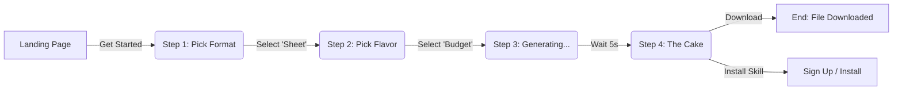
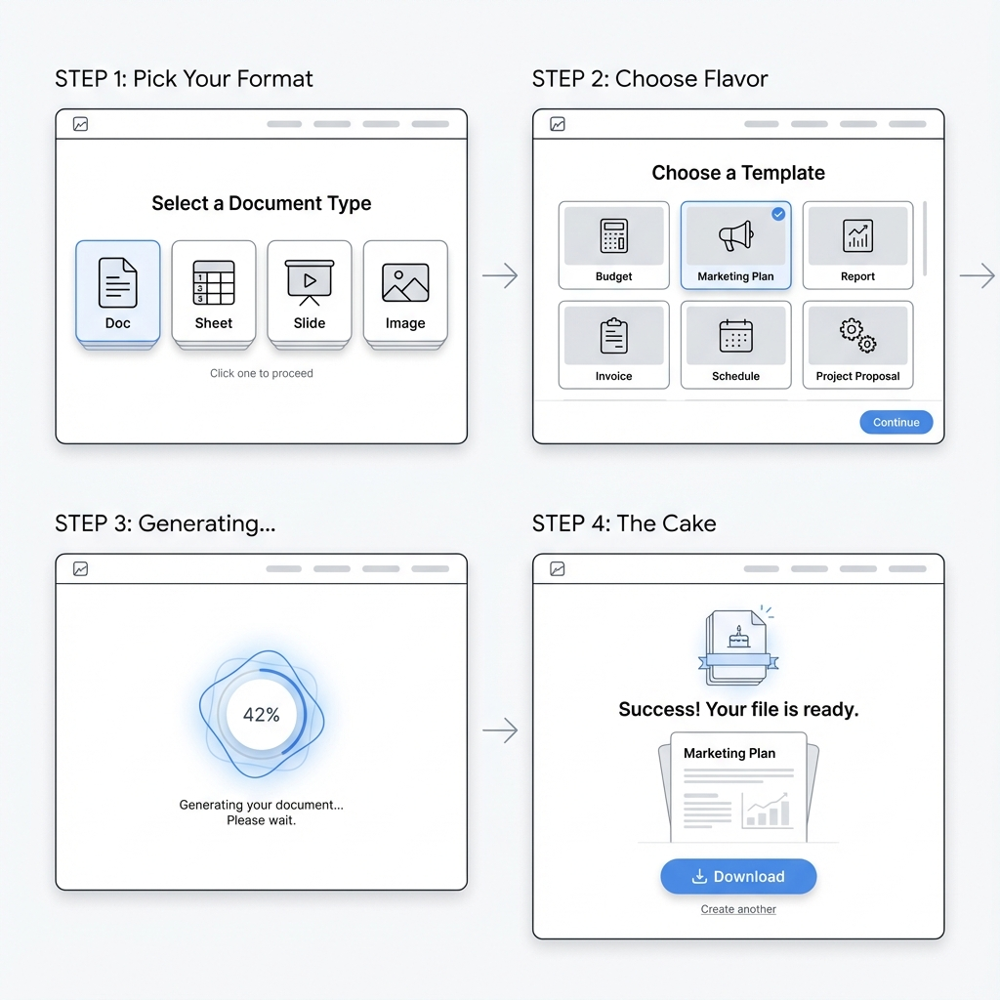

# design: Interactive Onboarding Flow

**Status**: Draft Design
**Related Issue**: #36
**Goal**: Reduce time-to-value to <60 seconds.

## User Flow
The goal is to get the user to a high-quality artifact ("The Cake") as fast as possible, proving the platform's value before asking for commitment.

## Visual Storyboard

## Step-by-Step Breakdown

### Step 1: Pick Your Format
*   **Headline**: "What do you want to create?"
*   **Options**: 
    1.  **Document** (Report, Brief, Spec)
    2.  **Spreadsheet** (Budget, Timeline, Data)
    3.  **Presentation** (Pitch Deck, Update)
    4.  **Image** (Social Asset, Logo)
*   **Vibe**: Big, tactile buttons. No text input required yet.

### Step 2: Choose Flavor (Template)
*   **Context**: "Okay, a Spreadsheet. What kind?"
*   **Options**: Show 3-4 high-value use cases (e.g., "Startup Budget", "Event Timeline", "Marketing Plan").
*   **Action**: Clicking one immediately triggers Step 3.

### Step 3: Generating... (The "Baker")
*   **Visual**: A sleek, reassuring loader.
*   **Micro-copy**: "Analyzing requirements...", "Formatting cells...", "Creating formulas..."
*   **Purpose**: Build anticipation and show that "work" is happening.

### Step 4: The Cake (Value Realization)
*   **Visual**: A massive, realistic preview of the file.
*   **Primary Action**: "Download [File]" (e.g., Download .xlsx).
*   **Secondary Action**: "Install this Skill for $0".
*   **Psychology**: Give them the fish first. Then sell the fishing rod.
